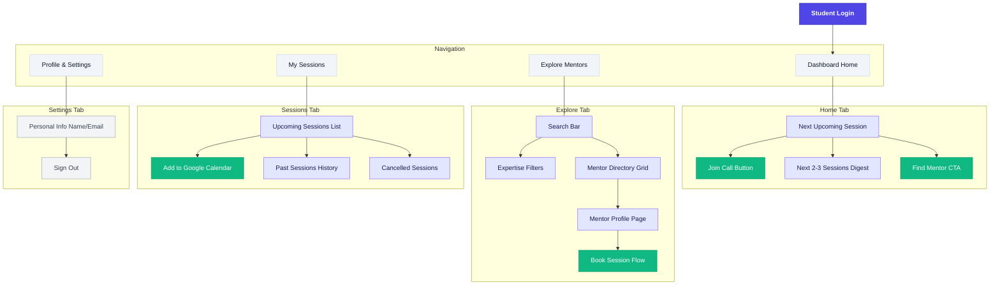
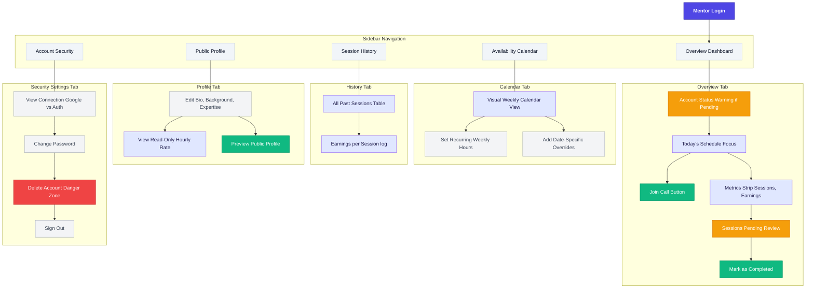
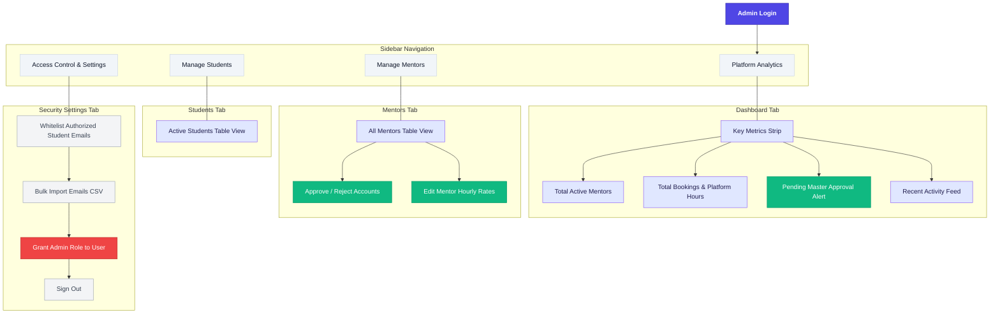

# Mentorly Information Architecture (IA) Restructure Plan

## Executive Summary
Currently, the Mentorly application displays features for Student, Mentor, and Admin personas on single, monolithic dashboard pages. This causes cognitive overload and clutters the UI.

This document outlines a new Information Architecture (IA) designed around **Progressive Disclosure**, separating features into clearly delineated tabs or navigation routes. The goal is to retain all existing backend functionality but reorganize the UI to prioritize immediate user goals.

---

## IA Categorization Framework
Every feature in the app must be categorized into one of three buckets for each persona:

1. **Actionable (High Prominence):** The primary tools users need to "do their job" immediately (e.g., joining a call, booking a session, approving a mentor).
2. **Consumption (Medium Prominence):** Data and information the user needs to monitor or digest (e.g., upcoming schedule, key metrics, past history).
3. **Configuration (Low Prominence):** Foundational setups, profile editing, and security settings. These are "set it and forget it" actions that must be hidden behind dedicated "Settings" or "Profile" tabs to keep the main dashboards clean.

---

## 1. Student Persona IA

**Goal:** Focus entirely on the immediate next action (joining a call or finding a mentor) while keeping past history accessible but secondary.

### UI Structure (Top or Sidebar Navigation)
*   **Home / Overview:** 
    *   *Hero Section:* "Next Upcoming Session" prominently displayed with a large "Join Call" button (active 5 mins before).
    *   *Quick Actions:* Prominent "Find a Mentor" Call-to-Action.
    *   *Digest:* A quick glance at the next 2-3 upcoming sessions.
*   **Explore Mentors (The Marketplace):**
    *   Remains the main discovery hub with search and expertise filters.
*   **My Sessions (Dedicated Page):**
    *   *Tabs:* "Upcoming", "Past", "Cancelled".
    *   *Details:* Full list of all sessions with options to add to Google Calendar.
*   **Settings / Profile:**
    *   Basic info (Name, Email), linked accounts (Google Auth), and Sign Out.

### Student IA Diagram

---

## 2. Mentor Persona IA

**Goal:** Separate day-to-day operations (managing calls) from configuration (setting up the profile/availability). The dashboard must be a command center, not a setup wizard.

### UI Structure (Sidebar Navigation)
*   **Dashboard (Command Center):**
    *   *Immediate Focus:* "Today's Schedule" or "Next Session" prominently displayed.
    *   *Metrics Strip:* Upcoming sessions, completed sessions, total earned (₹).
    *   *Action Items:* "Sessions Pending Review" (where they must manually click "Mark as Completed" to track earnings).
*   **Calendar / Availability (The Engine):**
    *   *Main View:* Visual weekly calendar showing availability.
    *   *Manage Availability:* Dedicated section to set recurring weekly hours.
    *   *Date Overrides:* Section to add specific date blocks or extra slots.
*   **Session History:**
    *   Clean table of all past sessions, statuses, and individual session earnings.
*   **Profile (Public Facing):**
    *   Edit Bio, Work Background, Expertise Tags.
    *   *Preview:* Button to see exactly how students view their profile.
    *   *Read-Only:* Display their Hourly Rate (noting that only Admin can change it).
*   **Account Security (Settings):**
    *   Auth Provider Details (Google OAuth vs Email/Password).
    *   Change Password (if applicable).
    *   Delete Account / Data Export (Danger Zone).
    *   Sign Out.

### Mentor IA Diagram

---

## 3. Admin Persona IA

**Goal:** Provide a high-level overview of platform health with drill-down capabilities for specific operational tasks. Highly sensitive configuration tasks must be isolated.

### UI Structure (Sidebar Navigation)
*   **Overview (Bird's Eye View):**
    *   *Key Metrics:* Total active mentors, total booked sessions, total platform hours completed (New), pending approvals.
    *   *Alerts:* Prominent notification for mentors awaiting approval.
    *   *Recent Activity:* Feed of latest registrations and bookings.
*   **Mentor Management:**
    *   *Table View:* List of all mentors, Emails, Status (Active/Pending), Earnings.
    *   *Actions:* Approve/Reject accounts, Edit Mentor Hourly Rates.
*   **Student Management:**
    *   *Table View:* List of all active students.
*   **Access Control & Config (The "Hidden" Area):**
    *   *Authorized Emails:* UI to upload CSV or manually enter allowed student emails (Whitelist).
    *   *Admin Roles:* UI to grant Admin access to other users. This must be separated from general Student/Mentor management to prevent mistakes.

### Admin IA Diagram

